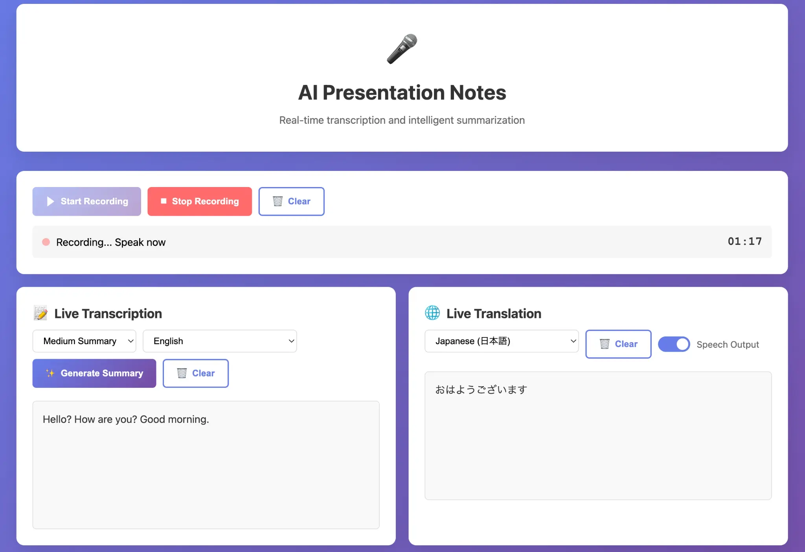

# AI Presentation Notes

**Real-time transcription, translation, and intelligent summarization powered by Deepgram and Manus AI**



## Overview

AI Presentation Notes is a full-stack web application that enables real-time speech-to-text transcription, automatic translation into multiple languages, and AI-powered summarization. Built with modern web technologies and powered by Deepgram's advanced speech recognition and Manus LLM for intelligent text processing, this application is ideal for professionals who need to capture, translate, and summarize presentations, meetings, and lectures.

**Live Demo:** [https://aitranslate-ldz4tszz.manus.space](https://aitranslate-ldz4tszz.manus.space)

## Features

### Core Functionality

- **Real-time Speech Transcription**: Captures audio input and converts it to text in real-time using Deepgram's Nova-2 model
- **Live Translation**: Automatically translates transcribed text into 10 different languages (Japanese, Spanish, Chinese, French, Italian, Korean, Arabic, Hindi, Russian, Indonesian)
- **AI-Powered Summarization**: Generates intelligent summaries in three formats:
  - **Short Summary**: 4-5 lines for quick executive overview
  - **Medium Summary**: 3-4 paragraphs with balanced coverage
  - **Detailed Summary**: Comprehensive coverage of all major points
- **Multi-language Support**: Summaries can be generated in 10 languages
- **Text-to-Speech Output**: Automatic speech synthesis for translated content using Web Speech API
- **Session Management**: Maintains recording sessions with persistent transcript data
- **Export Functionality**: Download transcripts, translations, and summaries as TXT or JSON files

### Technical Features

- **Chunked Audio Processing**: Processes audio in 10-second chunks for efficient real-time handling
- **Responsive Design**: Mobile-friendly interface with adaptive layouts
- **Error Handling**: Comprehensive error handling and user feedback
- **Status Indicators**: Real-time status updates during recording and processing

## Architecture

### Technology Stack

**Frontend:**
- HTML5 with Vanilla JavaScript
- CSS3 with responsive design
- Web Audio API for microphone access
- Web Speech API for text-to-speech
- MediaRecorder API for audio capture

**Backend:**
- Node.js with Express.js
- TypeScript for type safety
- Multer for file upload handling
- OpenAI-compatible API client for LLM integration

**External APIs:**
- **Deepgram API**: Speech-to-text transcription (Nova-2 model)
- **Manus LLM**: Translation and summarization (OpenAI-compatible interface)

### System Architecture

```
┌─────────────────────────────────────────────────────────────┐
│                     Frontend (Browser)                      │
│  ┌──────────────┐  ┌──────────────┐  ┌──────────────┐       │
│  │ Audio Input  │  │ Transcription│  │ Translation  │       │
│  │ (Microphone) │  │   Display    │  │   Display    │       │
│  └──────────────┘  └──────────────┘  └──────────────┘       │
│  ┌──────────────┐  ┌──────────────┐  ┌──────────────┐       │
│  │  Summary     │  │ Export (TXT) │  │ Export (JSON)│       │
│  │  Display     │  │              │  │              │       │
│  └──────────────┘  └──────────────┘  └──────────────┘       │
└─────────────────────────────────────────────────────────────┘
                            ↓ HTTP/REST
┌─────────────────────────────────────────────────────────────┐
│                    Backend (Express.js)                     │
│  ┌──────────────────────────────────────────────────────┐   │
│  │              REST API Endpoints                      │   │
│  │  • POST /api/start-session                           │   │
│  │  • POST /api/upload-chunk                            │   │
│  │  • POST /api/stop-session                            │   │
│  │  • POST /api/generate-summary                        │   │
│  │  • POST /api/translate                               │   │
│  └──────────────────────────────────────────────────────┘   │
│  ┌──────────────────────────────────────────────────────┐   │
│  │         Session Management & Processing              │   │
│  │  • In-memory session storage                         │   │
│  │  • Audio chunk accumulation                          │   │
│  │  • Transcript concatenation                          │   │
│  └──────────────────────────────────────────────────────┘   │
└─────────────────────────────────────────────────────────────┘
    ↓ API Calls                          ↓ API Calls
┌──────────────────────┐     ┌──────────────────────────┐
│   Deepgram API       │     │    Manus LLM API         │
│  (Speech-to-Text)    │     │  (Translation & Summary) │
└──────────────────────┘     └──────────────────────────┘
```

## API Endpoints

### Session Management

#### Start Session
```
POST /api/start-session
Content-Type: application/json

Response:
{
  "success": true,
  "session_id": "uuid-string",
  "message": "Session started successfully"
}
```

#### Upload Audio Chunk
```
POST /api/upload-chunk
Content-Type: multipart/form-data

Parameters:
- audio: File (audio blob)
- session_id: string
- chunk_number: number (optional)

Response:
{
  "success": true,
  "chunk_number": "0",
  "transcription": "Hello, how are you?",
  "complete_text": "Hello, how are you?",
  "deepgram_calls": 1,
  "accumulated_size": 12345
}
```

#### Stop Session
```
POST /api/stop-session
Content-Type: application/json

Body:
{
  "session_id": "uuid-string"
}

Response:
{
  "success": true,
  "complete_text": "Full transcription...",
  "total_chunks": 1,
  "deepgram_calls": 1,
  "total_size": 12345
}
```

### Content Processing

#### Translate Text
```
POST /api/translate
Content-Type: application/json

Body:
{
  "text": "Hello, how are you?",
  "target_language": "ja",
  "previous_translation": "",
  "is_first_chunk": true
}

Response:
{
  "translation": "こんにちは、お元気ですか？"
}
```

#### Generate Summary
```
POST /api/generate-summary
Content-Type: application/json

Body:
{
  "session_id": "uuid-string",
  "summary_type": "medium",
  "summary_language": "en"
}

Response:
{
  "success": true,
  "summary": "Summary text...",
  "summary_type": "medium"
}
```

## Installation & Deployment

### Prerequisites

- Node.js 22.13.0 or higher
- npm or pnpm package manager
- Deepgram API key (get from https://console.deepgram.com)
- Manus platform credentials (for LLM API access)

### Local Development

1. **Clone the repository:**
```bash
git clone https://github.com/Tabibito-AI/ai-transcribe-translate-summarize-manus.git
cd ai-transcribe-translate-summarize-manus
```

2. **Install dependencies:**
```bash
pnpm install
```

3. **Set up environment variables:**
Create a `.env.local` file with:
```
DEEPGRAM_API_KEY=your_deepgram_api_key
BUILT_IN_FORGE_API_KEY=your_manus_api_key
BUILT_IN_FORGE_API_URL=https://api.manus.im
JWT_SECRET=your_jwt_secret
VITE_APP_TITLE=AI Presentation Notes
VITE_APP_LOGO=your_logo_url
```

4. **Start the development server:**
```bash
pnpm dev
```

The application will be available at `http://localhost:3000`

### Deployment on Manus Platform

1. **Initialize a new Manus project:**
```bash
# Use the Manus web development tools to create a new project
# with server, database, and user authentication features
```

2. **Configure environment variables:**
Set the following secrets in the Manus platform:
- `DEEPGRAM_API_KEY`: Your Deepgram API key
- `BUILT_IN_FORGE_API_KEY`: Manus LLM API key (auto-injected)
- `BUILT_IN_FORGE_API_URL`: Manus API endpoint (auto-injected)

3. **Deploy:**
```bash
# Push to Manus platform using the web interface
# or CLI tools
```

### Docker Deployment

A Dockerfile can be created for containerized deployment:

```dockerfile
FROM node:22-alpine

WORKDIR /app

COPY package*.json ./
RUN npm install

COPY . .

ENV NODE_ENV=production
EXPOSE 3000

CMD ["npm", "start"]
```

## Usage Guide

### Recording a Presentation

1. **Start Recording**: Click the "Start Recording" button
2. **Speak**: Speak clearly into your microphone
3. **Real-time Updates**: Watch the transcription and translation appear in real-time
4. **Stop Recording**: Click "Stop Recording" when finished

### Generating Summaries

1. **Select Summary Type**: Choose from Short, Medium, or Detailed
2. **Select Language**: Choose the language for the summary
3. **Generate**: Click "Generate Summary"
4. **View**: The summary will appear in the AI Summary section

### Exporting Results

1. **Export as TXT**: Click "Export TXT" to download a text file
2. **Export as JSON**: Click "Export JSON" to download structured data

## Supported Languages

The application supports translation and summarization in the following languages:

| Code | Language |
|------|----------|
| en | English |
| ja | Japanese (日本語) |
| es | Spanish (Español) |
| zh | Chinese (中文) |
| fr | French (Français) |
| it | Italian (Italiano) |
| ko | Korean (한국어) |
| ar | Arabic (العربية) |
| hi | Hindi (हिन्दी) |
| ru | Russian (Русский) |
| id | Indonesian (Bahasa Indonesia) |

## Project Structure

```
ai-transcribe-translate-summarize-manus/
├── client/                          # Frontend application
│   ├── index.html                   # Main HTML file
│   ├── src/
│   │   ├── App.tsx                  # React app component
│   │   ├── main.tsx                 # Entry point
│   │   ├── pages/                   # Page components
│   │   ├── components/              # Reusable components
│   │   └── lib/                     # Utility functions
│   └── public/                      # Static assets
├── server/                          # Backend application
│   ├── _core/
│   │   ├── index.ts                 # Server entry point
│   │   ├── audioRoutes.ts           # Audio processing routes
│   │   ├── llm.ts                   # LLM integration
│   │   ├── voiceTranscription.ts    # Voice transcription helper
│   │   └── ...                      # Other core modules
│   ├── routers.ts                   # tRPC router definitions
│   └── db.ts                        # Database helpers
├── drizzle/                         # Database schema
│   └── schema.ts                    # Table definitions
├── storage/                         # S3 storage helpers
├── shared/                          # Shared types and constants
├── package.json                     # Dependencies
├── tsconfig.json                    # TypeScript configuration
└── README.md                        # This file
```

## Key Files

### Frontend
- **`client/index.html`**: Main HTML with embedded JavaScript for the UI
- **`client/src/App.tsx`**: React application shell (for future enhancements)

### Backend
- **`server/_core/index.ts`**: Express server setup and middleware configuration
- **`server/_core/audioRoutes.ts`**: REST API endpoints for audio processing
- **`server/_core/llm.ts`**: Manus LLM integration for translation and summarization
- **`server/_core/voiceTranscription.ts`**: Voice transcription helper functions

## Configuration

### Deepgram Configuration

The application uses Deepgram's Nova-2 model with the following settings:
- **Model**: nova-2 (latest speech recognition model)
- **Language**: English (en)
- **Features**: Smart formatting, punctuation, diarization disabled

### LLM Configuration

The application uses Manus LLM (OpenAI-compatible API) for:
- **Translation**: Context-aware translation with previous translation context
- **Summarization**: Three-tier summarization with customizable output length

## Performance Considerations

- **Audio Chunking**: 10-second chunks for optimal real-time processing
- **Minimum Audio Size**: 1KB minimum audio data per chunk
- **API Rate Limiting**: Respects Deepgram and Manus API rate limits
- **Session Storage**: In-memory storage for active sessions (suitable for single-server deployments)

## Troubleshooting

### Microphone Access Denied
- Check browser permissions for microphone access
- Ensure HTTPS is used in production (required for microphone access)
- Try a different browser if the issue persists

### No Transcription Appearing
- Verify Deepgram API key is valid
- Check browser console for error messages
- Ensure audio input is being captured (check microphone levels)

### Translation Not Working
- Verify Manus LLM API key is configured
- Check that the target language is selected
- Review server logs for API errors

### Summary Generation Fails
- Ensure sufficient transcription text is available
- Verify LLM API connectivity
- Check server logs for detailed error information

## Security Considerations

- **API Keys**: Store API keys in environment variables, never in code
- **HTTPS**: Always use HTTPS in production
- **CORS**: Configure appropriate CORS policies
- **Input Validation**: All user inputs are validated on the backend
- **Session Management**: Sessions are stored in memory and cleared on server restart

## Future Enhancements

- [ ] Database persistence for session history
- [ ] User authentication and multi-user support
- [ ] Advanced speaker diarization
- [ ] Custom vocabulary support
- [ ] Real-time collaboration features
- [ ] Mobile app versions
- [ ] Webhook support for external integrations
- [ ] Advanced analytics and insights

## Contributing

Contributions are welcome! Please follow these guidelines:

1. Fork the repository
2. Create a feature branch (`git checkout -b feature/amazing-feature`)
3. Commit your changes (`git commit -m 'Add amazing feature'`)
4. Push to the branch (`git push origin feature/amazing-feature`)
5. Open a Pull Request

## License

This project is proprietary software. All rights reserved.

## Support

For issues, questions, or feature requests, please contact the development team or open an issue on GitHub.

## Acknowledgments

- **Deepgram**: Providing state-of-the-art speech recognition technology
- **Manus AI**: Providing powerful LLM capabilities for translation and summarization
- **Open Source Community**: For the excellent tools and libraries used in this project

## Changelog

### Version 1.0.0 (2025-10-26)
- Initial release
- Real-time speech transcription with Deepgram
- Multi-language translation with Manus LLM
- AI-powered summarization (short, medium, detailed)
- Text-to-speech output
- Export functionality (TXT, JSON)
- Responsive web interface

---

**Last Updated**: October 26, 2025

**Deployed At**: [https://aitranslate-ldz4tszz.manus.space](https://aitranslate-ldz4tszz.manus.space)

